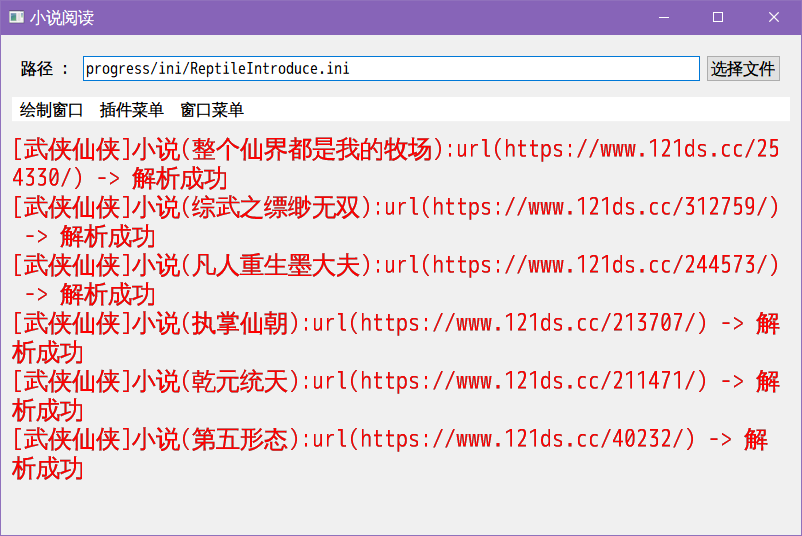

# QReptileIntroduce

## 介绍
qt 实现网络爬虫（小说）

## 软件架构
Qt 6.6.2

## 使用说明


1.  具备 cmake
2.  运行时使用 安装，否则无法自动配置 qt 所需要环境（也可以手动使用 qt 的配置环境，如 *deployqt 工具，在 Qt Creator 环境运行）
3.  先生成目标(运行 1 号可自行程序的安装)
4.  调用实用工具 [lupdate] (运行 3 号工具)
5.  使用 Qt Linguist 软件进行翻译
6.  调用实用工具 [lrelease] (运行 2 号工具)
7.  调试程序（/运行程序 ）

## 软件说明



### 插件菜单


代表所有加载的插件功能

### 窗口菜单


可以配置该进程的设置

### 路径

表示配置软件的配置文件

### 配置

#### [菜单字体]

用于配置显示菜单字体

#### [绘制字体]

用于配置显示字体

##### 字体关键字

名称

点大小

加重

斜体

加粗

划线

字体风格

#### [插件]

影响插件查找

##### 字体关键字

配置路径 -> 配置插件的查找路径

#### 选择窗口默认路径

影响弹出窗口的默认路径

##### 字体关键字

插件路径 -> 选择插件路径时，默认显示该路径

### [网络]

影响网络内容的配置路径

##### 字体关键字

配置文件路径 -> 建议写入路径

## 插件

##### 代码目录

QReptileIntroduce\srcs\libs\ShaderModel\plugs

##### 模板目录

QReptileIntroduce\srcs\cmake\temp\cpp_code

##### cmake 关联命令

```cmake
set( target_update_sub_dir_list )
list( APPEND target_update_sub_dir_list
	"RequestDefinition"
	"Request"
	"RequestNetPlugin"
	"NovelInfo"
)

foreach( plug_dir ${plug_path_list} )
	foreach( target_update_sub_dir ${target_update_sub_dir_list} )
		update_path_files_if( "${cmake_definitions_tmp}/cpp_code/${target_update_sub_dir}" "${plug_dir}/${target_update_sub_dir}" )
	endforeach()
endforeach()

```

###### update_path_files_if 定义

```cmake

# 如果不存在文件，则更新路径所有的文件与文件夹
# 该操作会直接覆盖已经存在的文件，并且把源存在的文件拷贝到目标目录上
# src_path : 源，提供更新的参考文件
# des_path : 目标，提供有效的目标信息
function( update_path_files_if src_path des_path )
	# message( "update_path_files :" "\n\t*\t" ${src_path} "\n\t*\t" ${des_path} )
	file( GLOB_RECURSE file_get_src_file_paths RELATIVE "${src_path}" "${src_path}/*" )
	file( GLOB_RECURSE file_get_des_file_paths RELATIVE "${des_path}" "${des_path}/*" )

	foreach( file_path ${file_get_src_file_paths} )
		set( src_file_path "${src_path}/${file_path}" )

		if( NOT EXISTS "${des_path}/${file_path}" )
			message( "update_path_files_if => 源 (" ${src_path}/${file_path} ") 拷贝到 [" ${des_path}"]" )
			file( COPY "${src_file_path}"
				DESTINATION "${des_path}" )
		endif()
	endforeach()
endfunction()

```

##### 开发

插件目录下创建基于网站的 url 文件夹，拷贝 插件已有的 CMakeLists.txt 文件，运行 cmake 生成缓冲，即可新建自定义插件。

新建的自定义插件已经存在基于 QReptileIntroduce\srcs\cmake\temp\cpp_code 下的所有代码。如果不存在，它会重新生成，直到目录不存在。

###### RequestNet 类

实现请求 html 页面之后的解析能力，实现自 IRequestNetInterface 接口类

```c++

#include "../nameSpace/interfacePlugsType.h"
class IStream;
class OStream;
namespace interfacePlugsType {
	/// <summary>
	/// 这是一个回调接口，它总是处于被调用的状态
	/// </summary>
	class NOVELINFO_EXPORT IRequestNetInterface {
	public:
		virtual ~IRequestNetInterface( ) {
		}
	public:
		/// <summary>
		/// 初始化之前，被动调用
		/// 使用对象之前，应该调用该函数一次，并且它必须在 initBefore() 之前
		/// </summary>
		/// <returns>初始化之前</returns>
		virtual int initAfter( ) = 0;
		/// <summary>
		/// 初始化之后，被动调用
		/// 使用对象之前，应该调用该函数一次，并且它必须在 initAfter() 之后
		/// </summary>
		/// <returns>初始化直走</returns>
		virtual int initBefore( ) = 0;
		/// <summary>
		/// 获取附加数据
		/// </summary>
		/// <returns>附加数据</returns>
		virtual void getData( void *resultAnyPtr ) = 0;

		/// <summary>
		/// 获取 url
		/// </summary>
		/// <param name="outStr">输出的 url</param>
		/// <returns>该对象的 url 长度</returns>
		virtual size_t getRootUrl( HtmlDocString *outStr ) = 0;
		/// <summary>
		/// 设置网站地址
		/// </summary>
		/// <param name="url">网站的首地址</param>
		virtual void setRootUrl( const HtmlDocString &url ) = 0;

		/// <summary>
		/// 设置域
		/// </summary>
		/// <param name="host">域</param>
		virtual void setHost( const HtmlDocString &host ) = 0;
		/// <summary>
		/// 获取域
		/// </summary>
		/// <returns>域</returns>
		virtual size_t getHost( HtmlDocString *outHost ) = 0;
		/// <summary>
		/// 设置协议
		/// </summary>
		/// <param name="scheme">协议</param>
		virtual void setScheme( const HtmlDocString &scheme ) = 0;
		/// <summary>
		/// 获取协议
		/// </summary>
		/// <returns>协议</returns>
		virtual size_t getScheme( HtmlDocString *outScheme ) = 0;
		/// <summary>
		/// 获取小说当中的类型与网址映射列表
		/// </summary>
		/// <param name="request_url">解析页的 url</param>
		/// <param name="htmlText">解析页面</param>
		/// <returns>类型与目标地址</returns>
		virtual Map_HtmlStrK_HtmlStrV * formHtmlGetTypeTheUrls( const HtmlDocString &request_url, const HtmlDocString &htmlText ) = 0;

		/// <summary>
		/// 从页中返回解析到的小说
		/// </summary>
		/// <param name="type_name">页类型名称</param>
		/// <param name="request_url">请求页的 url</param>
		/// <param name="htmlText">请求页</param>
		/// <param name="saveNovelInfos">已经存储的小说</param>
		/// <param name="appendDataPtr">附加的数据对象指针</param>
		/// <returns>解析到的小说列表</returns>
		virtual Vector_INovelInfoSPtr formHtmlGetTypePageNovels( const HtmlDocString &type_name, const HtmlDocString &request_url, const HtmlDocString &htmlText, const Vector_INovelInfoSPtr &saveNovelInfos, void *appendDataPtr ) = 0;

		/// <summary>
		/// 从一个链接当中获取单个小说信息，这个行为不建议在 formHtmlGetTypePageNovels 中调用，而是作为被调用者隐式回调使用
		/// </summary>
		/// <param name="request_url">获取页的 url</param>
		/// <param name="htmlText">小说所在的链接请求返回</param>
		/// <param name="saveNovelInfos">已经存储的小说列表</param>
		/// <param name="networkReplayNovel">当前获取的小说页面内容</param>
		/// <returns>小说信息对象指针</returns>
		virtual INovelInfo_Shared formHtmlGetUrlNovelInfo( const HtmlDocString &request_url, const HtmlDocString &htmlText, const Vector_INovelInfoSPtr &saveNovelInfos, const INovelInfo_Shared &networkReplayNovel ) = 0;
		/// <summary>
		/// 基于请求实现后进行下一次请求的判定
		/// 返回有效的链接对象表示继续请求，无效对象则退出请求
		/// </summary>
		/// <param name="type_name">页类型名称</param>
		/// <param name="request_url">解析下一页的 url</param>
		/// <param name="htmlText">需要判断的网页内容</param>
		/// <param name="saveNovelInfos">已经保存的小说列表</param>
		/// <param name="lastNovelInfos">调用该成员函数之前已经存储的对象列表，与 saveNovelInfos 不同的是，它仅仅存储一页</param>
		/// <returns>下一页的地址</returns>
		virtual HtmlDocString formHtmlGetNext( const HtmlDocString &type_name, const HtmlDocString &request_url, const HtmlDocString &htmlText, const Vector_INovelInfoSPtr &saveNovelInfos, const Vector_INovelInfoSPtr &lastNovelInfos ) = 0;
		/// <summary>
		/// 是否请求小说详情页面
		/// </summary>
		/// <param name="novel_info_ptr">查询的小说</param>
		/// <returns>如果需要获取，则返回 true，否则返回 true</returns>
		virtual bool isRequestNovelInfoUrl( const INovelInfoPtr &novel_info_ptr ) = 0;
		/// <summary>
		/// 类型调用结束时候会被调用
		/// </summary>
		/// <param name="root_url">根路径</param>
		/// <param name="type_name">请求类型名称</param>
		/// <param name="url">类型页面</param>
		/// <param name="saveNovelInfos"></param>
		virtual void novelTypeEnd( const HtmlDocString &root_url, const HtmlDocString &type_name, const HtmlDocString &url, const interfacePlugsType::Vector_INovelInfoSPtr &saveNovelInfos ) = 0;
		/// <summary>
		/// 结束该网站请求时被调用
		/// </summary>
		virtual void endHost( const Vector_INovelInfoSPtr &saveNovelInfos ) = 0;
		/// <summary>
		/// 设置父类
		/// </summary>
		/// <param name="parent">父节点</param>
		/// <returns>是否成功</returns>
		virtual bool setInterfaceParent( void *parent ) = 0;
		/// <summary>
		/// 删除成员
		/// </summary>
		virtual void deleteMember( ) = 0;

		/// <summary>
		/// 设置输出流
		/// </summary>
		/// <param name="o_stream">输出流对象</param>
		/// <returns>旧的流</returns>
		virtual OStream * setOStream( OStream *o_stream ) = 0;

		/// <summary>
		/// 设置输入流
		/// </summary>
		/// <param name="i_stream">输入流对象</param>
		/// <returns>旧的流</returns>
		virtual IStream * setIStream( IStream *i_stream ) = 0;
	};

}

```

###### NovelInfo 类

实现存储小说信息的能力，实现自 INovelInfo 接口类

```c++
namespace interfacePlugsType {
	class NOVELINFO_EXPORT INovelInfo {

	public:
		INovelInfo( ) = default;
		virtual ~INovelInfo( ) { }
	public: //-纯虚函数
		/// <summary>
		/// 获取小数名称
		/// </summary>
		/// <param name="result_name">返回名称</param>
		/// <returns>名称大小</returns>
		virtual size_t getNovelName( HtmlDocString *result_name ) = 0;
		/// <summary>
		/// 获取小说详细信息
		/// </summary>
		/// <param name="result_info">返回信息</param>
		/// <returns>信息大小</returns>
		virtual size_t getNovelInfo( HtmlDocString *result_info ) = 0;
		/// <summary>
		/// 获取小说最后更新
		/// </summary>
		/// <param name="result_time">返回最后时间</param>
		/// <returns>时间长度</returns>
		virtual size_t getNovelUpdateTime( HtmlDocString *result_time ) = 0;
		/// <summary>
		/// 获取小说最后更新时间的格式
		/// </summary>
		/// <param name="result_format">返回最后时间的格式</param>
		/// <returns>格式长度</returns>
		virtual size_t getNovelUpdateTimeFormat( HtmlDocString *result_format ) = 0;
		/// <summary>
		/// 获取最后请求时间
		/// </summary>
		/// <param name="result_last_request_time">返回的最后请求时间</param>
		/// <returns>返回长度</returns>
		virtual size_t getNovelLastRequestGetTime( HtmlDocString *result_last_request_time ) = 0;
		/// <summary>
		/// 获取最后请求时间的格式
		/// </summary>
		/// <param name="result_last_request_time_format">返回最后请求时间的格式</param>
		/// <returns>格式长度</returns>
		virtual size_t getNovelLastRequestGetTimeFormat( HtmlDocString *result_last_request_time_format ) = 0;
		/// <summary>
		/// 获取小说的作者
		/// </summary>
		/// <param name="result_author">返回小说作者</param>
		/// <returns>小说作者信息的长度</returns>
		virtual size_t getNovelAuthor( HtmlDocString *result_author ) = 0;
		/// <summary>
		/// 获取小说 url
		/// </summary>
		/// <param name="result_url">返回小说 url</param>
		/// <returns>小说 url 长度</returns>
		virtual size_t getNovelUrl( HtmlDocString *result_url ) = 0;
		/// <summary>
		/// 获取小说最后更新项
		/// </summary>
		/// <param name="result_last_item">返回小说最后更新项</param>
		/// <returns>返回项的长度</returns>
		virtual size_t getNovelLastItem( HtmlDocString *result_last_item ) = 0;
		/// <summary>
		/// 获取小说附加信息
		/// </summary>
		/// <param name="result_additional_data">直线附加信息的指针，如果为 nullptr 则不存在</param>
		/// <returns>小说附加信息的长度，如果为 0， 并且 result_additional_data 不等于 nullptr。则指向的内容存在，但为空</returns>
		virtual size_t getNovelAttach( void *&result_additional_data ) = 0;
		/// <summary>
		/// 获取小说解析的页面所在地址
		/// </summary>
		/// <param name="result_type_page_url">返回小说获取的页面，该页面并非小说详情页面而是从那获取小说详情页面的地址</param>
		/// <returns>地址长度</returns>
		virtual size_t getNovelUrlAtPageLocation( HtmlDocString *result_type_page_url ) = 0;
		/// <summary>
		/// 获取小说的类型
		/// </summary>
		/// <param name="result_type_name">返回小说类型</param>
		/// <returns>类型名称</returns>
		virtual size_t getNovelTypeName( HtmlDocString *result_type_name ) = 0;

		/// <summary>
		/// 对象转换到字符串
		/// </summary>
		/// <param name="result_serializable_html_doc_string">字符串返回</param>
		/// <returns>字符串大小</returns>
		virtual size_t objToHtmlDocString( HtmlDocString *result_serializable_html_doc_string ) = 0;
		
	};
}
```

###### RequestNetPlugin 类

实现动态构建插件，实现自QGenericPlugin

```c++

class RequestNetPlugin : public QGenericPlugin {
	Q_OBJECT;
	Q_PLUGIN_METADATA( IID QGenericPluginFactoryInterface_iid );
public:
	explicit RequestNetPlugin( QObject *parent = nullptr );
	~RequestNetPlugin( ) override;
private:
	QObject *create( const QString &name, const QString &spec ) override;
};

```

