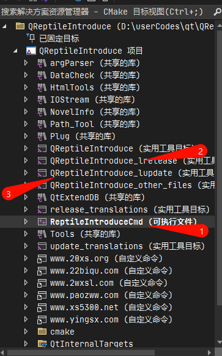
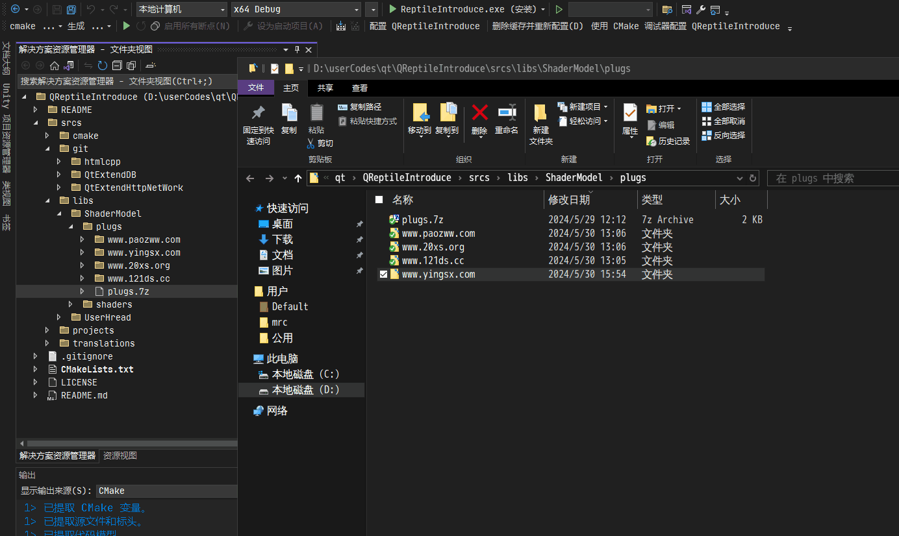

# QReptileIntroduce

## 介绍
qt 实现网络爬虫（小说）

## 软件架构

Qt 6.6.2

## 使用说明



1.  具备 cmake
2.  运行时使用 安装，否则无法自动配置 qt 所需要环境（也可以手动使用 qt 的配置环境，如 *deployqt 工具，在 Qt Creator 环境运行）
3.  先生成目标(运行 1 号的安装任务)
4.  调用实用工具 [lupdate] (运行 3 号工具-暂时不支持)
5.  使用 Qt Linguist 软件进行翻译-暂时不支持
6.  调用实用工具 [lrelease] (运行 2 号工具-暂时不支持)
7.  调试程序（/运行程序 -调试前需要运行安装任务，或者直接调试安装任务生成的 ReptileIntroduceCmd.exe）

# 软件说明

## QReptileIntroduceCMD

基于命令行实现的多进程爬虫

### 选项

#### -h

输出帮助信息

#### -name

输出软件信息

#### -p

获取到的内容将会存放在该目录

#### -t

指定获取类型的配置文件

配置文件以每行为一个关键字

#### -s

指定运行爬虫，需要配合 -l 选项

#### -as

运行所有爬虫，所有被 -l 加载的爬虫

#### -l

加载爬虫插件

#### -edb

激活全导出功能，与 -w 、-rdb 同时使用

#### -fkf

指定查找 -rdb 指定包含关键字的小说的的关键字配置文件，并且依赖 -w 输出到目录

当指定路径为无效时，自动激活 -edb选项

可以同时与 -edb 使用

#### -ijtenf

指定忽略 -rdb 指定包含关键字的小说名称的关键字配置文件，并且依赖 -w 输出到目录，该选项影响 -fkf

该选项完全匹配标题

#### -ijtsnf

指定忽略 -rdb 指定包含关键字的小说名称的关键字配置文件，并且依赖 -w 输出到目录，该选项影响 -fkf

该选项段内匹配标题

#### -w

指定输出路径

当不存在 -fkf 时，该选项输出到 “选项/ export_all ”路径当中

当存在 -fkf 时，该选项输出到 “选项/ export_find ”路径当中

#### -rdb

指定数据库的路径，允许多个

#### -ex

指定过期选项， -ex 2 ，表示删除超过2天的小说

#### -fkrrlkse

获取删除目标的行关键字文件

必须存在有效 -fkrrlkd 选项

支持多个路径

支持文件与目录路径参数

删除 -fkrrlkd 所有 -fkrrlks 选项指定文件所包含的字符串的行关键字

#### -fkrrlkss

获取删除目标的行关键字文件

必须存在有效 -fkrrlkd 选项

支持多个路径

支持文件与目录路径参数

删除 -fkrrlkd 所有 -fkrrlkss 选项指定文件所包含的子字符串的行关键字

#### -fkrrlkd

处理删除目标的行关键字文件

必须存在有效 -fkrrlks 选项

支持多个路径

支持文件与目录路径参数

删除 -fkrrlkd 所有 -fkrrlks 选项指定的行关键字

#### -rm

发现有效数据库，但过滤关键字后发现没有需要导出或查找的小说信息时，删除 -w 指定路径

## 案例

### 案例 1


-fkrrlkd 删除 [..\filter\equ_names\女频\女频.txt] 文件中存在的关关键字

-fkrrlkss 使用[ ..\filter\sub_names\2024年6月11日.txt] 中的每行关键字去匹配 [..\filter\equ_names\女频\女频.txt]  每个关键字的子字符串，存在子字符串时，删除匹配的整个关键字

-fkrrlkse 使用[..\filter\equ_names\不可读\加密.txt]中的每行关键字去匹配 [..\filter\equ_names\女频\女频.txt]  每个关键字的完整字符串，存在完整字符串时，删除匹配的整个关键字

```bat
ReptileIntroduceCmd.exe -fkrrlkss ..\filter\sub_names\2024年6月11日.txt -fkrrlkse ..\filter\equ_names\不可读\加密.txt -fkrrlkd ..\filter\equ_names\女频\女频.txt  
```

### 案例2

-ex 删除 .\\data\\cmd_download_novels_info\\db 下所有合法的过期小说-过期为 3 天

```bat

ReptileIntroduceCmd.exe -rdb .\\data\\cmd_download_novels_info\\dbs -ex 3
```

### 案例3

读取数据库，并且过滤配置选项中的小说关键字，最后导出全部并查找匹配的小说

-rdb  读取 [.\\data\\cmd_download_novels_info\\dbs] 中的所有数据库

-fkf 使用 [.\\findKeys] 路径中的文件作为关键字，生成查找任务

-ijtenf 使用 [.\\filter\\equ_names] 下的文件作为过滤完全匹配小说名称关键字

-ijtsnf 使用 [.\\filter\\sub_names] 下的文件作为过滤子字符串匹配小说名称关键字

-edb 导出全部过滤后的小说

-rm 如果过滤后的有效小说为 0，则删除 [.\\data\\exports\export_all] 与  [.\\data\\exports\export_find] 

```
ReptileIntroduceCmd.exe  -rdb .\\data\\cmd_download_novels_info\\dbs -fkf .\\findKeys -ijtenf .\\filter\\equ_names -ijtsnf .\\filter\\sub_names -w .\\data\\exports\\ -edb -rm
```

### 案例4

-l 指定小说爬虫解析模块

-as 把小说解析模块全部运行

-p 爬虫解析模块解析到的小说存储到该历经下，该选项影响数据与异常日志的位置

-t 解析指定类型-一行一个类型。该选项影响小说爬虫解析模块当中是否解析小说类型的策略

```
ReptileIntroduceCmd.exe  -l  plug_lib -as -p .\\data\\cmd_download_novels_info -t .\\Release_x64_MSVC\\progress\\ini
```

## 插件

##### 代码目录

QReptileIntroduce\srcs\libs\ShaderModel\plugs

##### 模板目录

QReptileIntroduce\srcs\cmake\temp\cpp_code

##### cmake 关联命令

```cmake
# ###################          拷贝模板-不存在则拷贝
set( target_update_sub_dir_list )
list( APPEND target_update_sub_dir_list
	"RequestDefinition"
	"RequestNet"
	"RequestNetPlugin"
	"NovelInfo"
	"instance_function"
)

foreach( plug_dir ${plug_path_list} )
	foreach( target_update_sub_dir ${target_update_sub_dir_list} )
		update_path_files_if( "${cmake_definitions_tmp}/cpp_code/${target_update_sub_dir}" "${plug_dir}/${target_update_sub_dir}" )
	endforeach()
endforeach()
```

当需要对模板进行增加的时候，可以在 “ target_update_sub_dir_list ” 添加文件夹名称。

###### update_path_files_if 定义

```cmake

# 如果不存在文件，则更新路径所有的文件与文件夹
# 该操作会直接覆盖已经存在的文件，并且把源存在的文件拷贝到目标目录上
# src_path : 源，提供更新的参考文件
# des_path : 目标，提供有效的目标信息
function( update_path_files_if src_path des_path )
	# message( "update_path_files :" "\n\t*\t" ${src_path} "\n\t*\t" ${des_path} )
	file( GLOB_RECURSE file_get_src_file_paths RELATIVE "${src_path}" "${src_path}/*" )
	file( GLOB_RECURSE file_get_des_file_paths RELATIVE "${des_path}" "${des_path}/*" )

	foreach( file_path ${file_get_src_file_paths} )
		set( src_file_path "${src_path}/${file_path}" )

		if( NOT EXISTS "${des_path}/${file_path}" )
			message( "update_path_files_if => 源 (" ${src_path}/${file_path} ") 拷贝到 [" ${des_path}"]" )
			file( COPY "${src_file_path}"
				DESTINATION "${des_path}" )
		endif()
	endforeach()
endfunction()

```

##### 开发

插件目录下创建基于网站的 url 文件夹，拷贝 插件已有的 CMakeLists.txt 文件，运行 cmake 生成缓冲，即可新建自定义插件。



新建的自定义插件已经存在基于 QReptileIntroduce\srcs\cmake\temp\cpp_code 下的所有代码。如果不存在，它会重新生成，直到目录不存在。

###### RequestNet 类

实现请求 html 页面之后的解析能力，实现自 IRequestNetInterface 接口类

###### NovelInfo 类

实现存储小说信息的能力，实现自 INovelInfo 接口类

###### RequestNetPlugin 类

实现动态构建插件，实现自QGenericPlugin

