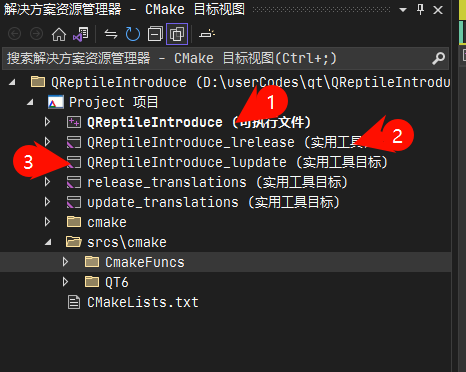
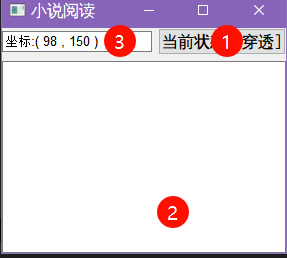

# QReptileIntroduce

## 介绍
qt 实现网络爬虫（小说）

## 软件架构
Qt 6.6.2

## 使用说明

1.  具备 cmake
2.  运行时使用 安装，否则无法自动配置 qt 所需要环境（也可以手动使用 qt 的配置环境，如 *deployqt 工具，在 Qt Creator 环境运行）
3.  先生成目标(运行 1 号可自行程序的安装)
4.  调用实用工具 [lupdate] (运行 3 号工具)
5.  使用 Qt Linguist 软件进行翻译
6.  调用实用工具 [lrelease] (运行 2 号工具)
7.  调试程序（/运行程序 ）

## 软件说明

鼠标左键 1 号，可以控制 2 号组件在 “穿透” 或 “未穿透” 之间切换。

鼠标右键 1 号，可以显示配置文件的读取窗口，读取完毕之后会显示在 2 号 组件上。

3号组件作为显示鼠标位置
