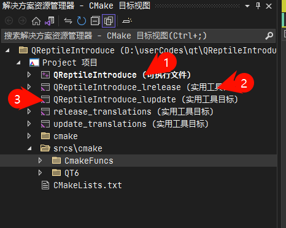
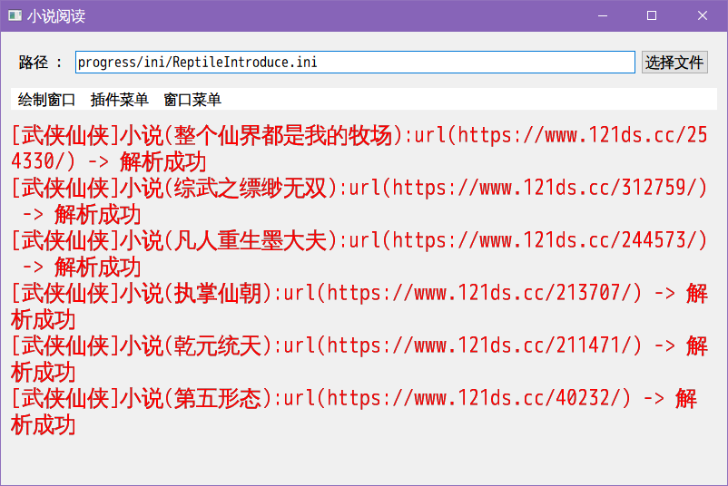

# QReptileIntroduce

## 介绍
qt 实现网络爬虫（小说）

## 软件架构

Qt 6.6.2

## 使用说明



1.  具备 cmake
2.  运行时使用 安装，否则无法自动配置 qt 所需要环境（也可以手动使用 qt 的配置环境，如 *deployqt 工具，在 Qt Creator 环境运行）
3.  先生成目标(运行 1 号可自行程序的安装)
4.  调用实用工具 [lupdate] (运行 3 号工具)
5.  使用 Qt Linguist 软件进行翻译
6.  调用实用工具 [lrelease] (运行 2 号工具)
7.  调试程序（/运行程序 ）

# 软件说明

## QReptileIntroduceCMD

基于命令行实现的多进程爬虫

### 选项

#### -v

输出软件的信息

#### -h

输出帮助信息

#### -url

输出当前的 url 信息，该选项与 -l 同时使用

#### -p

获取到的内容将会存放在该目录

#### -t

指定获取类型的配置文件

配置文件以每行为一个关键字

#### -s

指定运行爬虫，需要配合 -l 选项

#### -as

运行所有爬虫，所有被 -l 加载的爬虫

#### -l

加载爬虫插件

#### -fk

指定查找 -rdb 指定包含关键字的小说的关键字，并且依赖 -w 输出到目录

#### -fkf

指定查找 -rdb 指定包含关键字的小说的的关键字配置文件，并且依赖 -w 输出到目录

#### -ien

指定忽略 -rdb 指定完全匹配关键字的小说名称的关键字，并且依赖 -w 输出到目录，该选项影响 -fk 与 -fkf

#### -ienf

指定忽略 -rdb 指定完全匹配关键字的小说名称的关键字配置文件，并且依赖 -w 输出到目录，该选项影响 -fk 与 -fkf

#### -isn

指定忽略 -rdb 指定包含关键字的小说名称的关键字，并且依赖 -w 输出到目录，该选项影响 -ien、-ienf、-fk 与 -fkf

#### -isnf

指定忽略 -rdb 指定包含关键字的小说名称的关键字配置文件，并且依赖 -w 输出到目录，该选项影响 -ien、-ienf、-fk 与 -fkf

#### -ex

指定过期选项， -ex 2 ，表示删除超过2天的小说

#### -fkrrlks

获取删除目标的行关键字文件

必须存在有效 -fkrrlkd 选项

支持多个文件

删除 -fkrrlkd 所有 -fkrrlks 选项指定的行关键字

#### -fkrrlkd

处理删除目标的行关键字文件

必须存在有效 -fkrrlks 选项

支持多个文件

删除 -fkrrlkd 所有 -fkrrlks 选项指定的行关键字

#### 案例 [.\ReptileIntroduceCmd.exe  -fkrrlks ..\findKeys\年代.txt -fkrrlkd ..\findKeys\朝代.txt ]

删除 ..\findKeys\朝代.txt 文件中存在的关键字(行为单位，每个为 ..\findKeys\年代.txt  中的关键字)


## QReptileIntroduce

界面工具



### 插件菜单


代表所有加载的插件功能

### 窗口菜单


可以配置该进程的设置

### 路径

表示配置软件的配置文件

### 配置

#### [菜单字体]

用于配置显示菜单字体

#### [绘制字体]

用于配置显示字体

##### 字体关键字

名称

点大小

加重

斜体

加粗

划线

字体风格

#### [插件]

影响插件查找

##### 字体关键字

配置路径 -> 配置插件的查找路径

#### 选择窗口默认路径

影响弹出窗口的默认路径

##### 字体关键字

插件路径 -> 选择插件路径时，默认显示该路径

### [网络]

影响网络内容的配置路径

##### 字体关键字

配置文件路径 -> 建议写入路径

## 插件

##### 代码目录

QReptileIntroduce\srcs\libs\ShaderModel\plugs

##### 模板目录

QReptileIntroduce\srcs\cmake\temp\cpp_code

##### cmake 关联命令

```cmake
# ###################          拷贝模板-不存在则拷贝
set( target_update_sub_dir_list )
list( APPEND target_update_sub_dir_list
	"RequestDefinition"
	"RequestNet"
	"RequestNetPlugin"
	"NovelInfo"
	"instance_function"
)

foreach( plug_dir ${plug_path_list} )
	foreach( target_update_sub_dir ${target_update_sub_dir_list} )
		update_path_files_if( "${cmake_definitions_tmp}/cpp_code/${target_update_sub_dir}" "${plug_dir}/${target_update_sub_dir}" )
	endforeach()
endforeach()
```

当需要对模板进行增加的时候，可以在 “ target_update_sub_dir_list ” 添加文件夹名称。

###### update_path_files_if 定义

```cmake

# 如果不存在文件，则更新路径所有的文件与文件夹
# 该操作会直接覆盖已经存在的文件，并且把源存在的文件拷贝到目标目录上
# src_path : 源，提供更新的参考文件
# des_path : 目标，提供有效的目标信息
function( update_path_files_if src_path des_path )
	# message( "update_path_files :" "\n\t*\t" ${src_path} "\n\t*\t" ${des_path} )
	file( GLOB_RECURSE file_get_src_file_paths RELATIVE "${src_path}" "${src_path}/*" )
	file( GLOB_RECURSE file_get_des_file_paths RELATIVE "${des_path}" "${des_path}/*" )

	foreach( file_path ${file_get_src_file_paths} )
		set( src_file_path "${src_path}/${file_path}" )

		if( NOT EXISTS "${des_path}/${file_path}" )
			message( "update_path_files_if => 源 (" ${src_path}/${file_path} ") 拷贝到 [" ${des_path}"]" )
			file( COPY "${src_file_path}"
				DESTINATION "${des_path}" )
		endif()
	endforeach()
endfunction()

```

##### 开发

插件目录下创建基于网站的 url 文件夹，拷贝 插件已有的 CMakeLists.txt 文件，运行 cmake 生成缓冲，即可新建自定义插件。


新建的自定义插件已经存在基于 QReptileIntroduce\srcs\cmake\temp\cpp_code 下的所有代码。如果不存在，它会重新生成，直到目录不存在。

###### RequestNet 类

实现请求 html 页面之后的解析能力，实现自 IRequestNetInterface 接口类

###### NovelInfo 类

实现存储小说信息的能力，实现自 INovelInfo 接口类

###### RequestNetPlugin 类

实现动态构建插件，实现自QGenericPlugin

